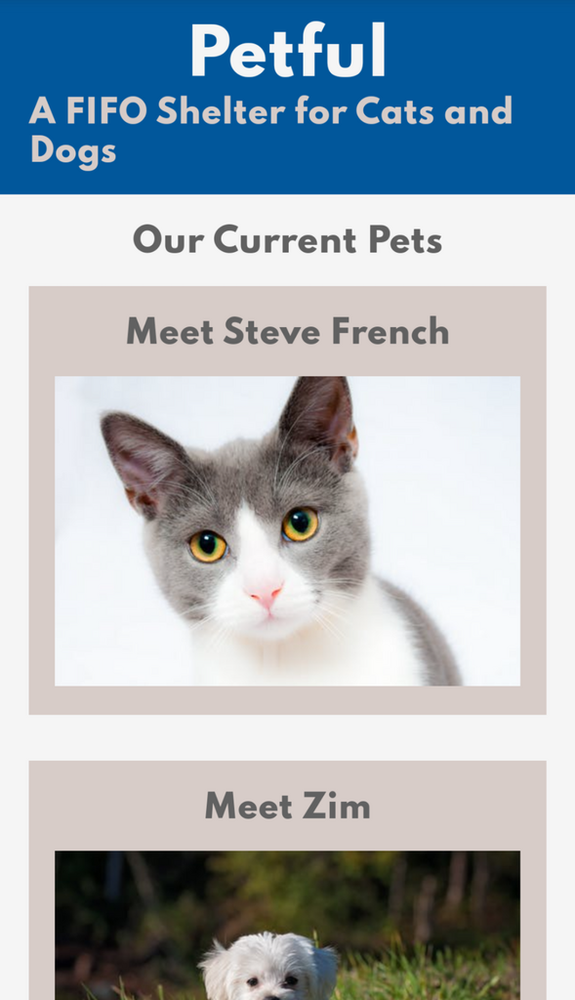
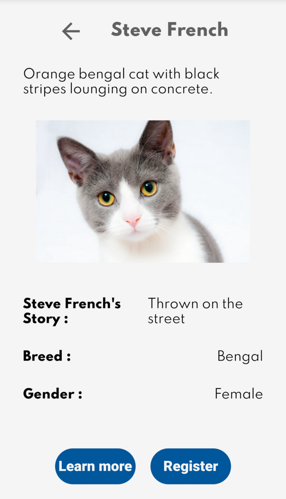
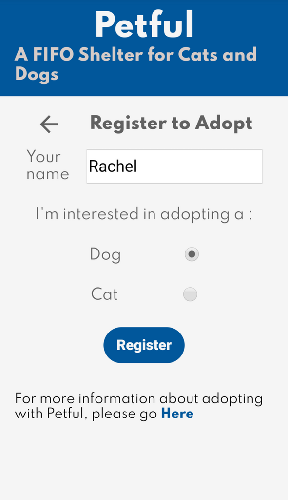

# Petful

Petful is an app for a shelter that only can hold one dog and one cat at a time. Users to add their name to a queue for pet adoption. When the pet is available, the user can choose if they want to keep it.

This is a repository of the Petful server.

View the live app [Here](https://petful-client-template-eight.vercel.app/)

Check out the client repository [Here](https://github.com/Rachanastasia/petful-client)

## Images

## Tech Stack

- Node.js
- Express
- Deployed with Heroku
